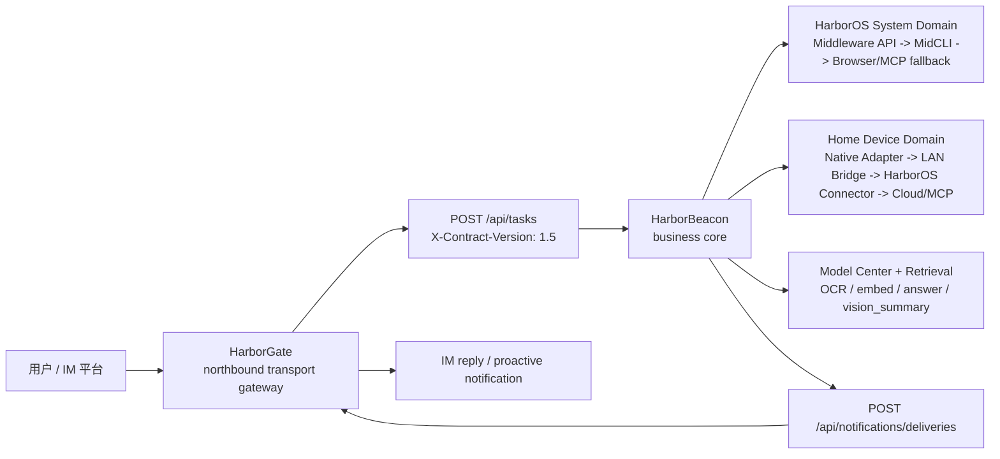
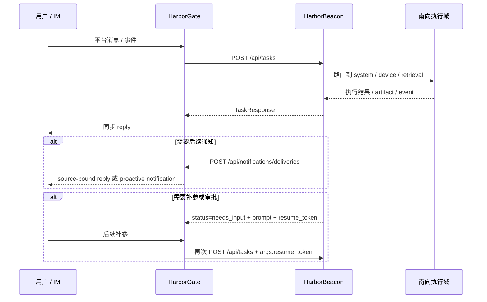
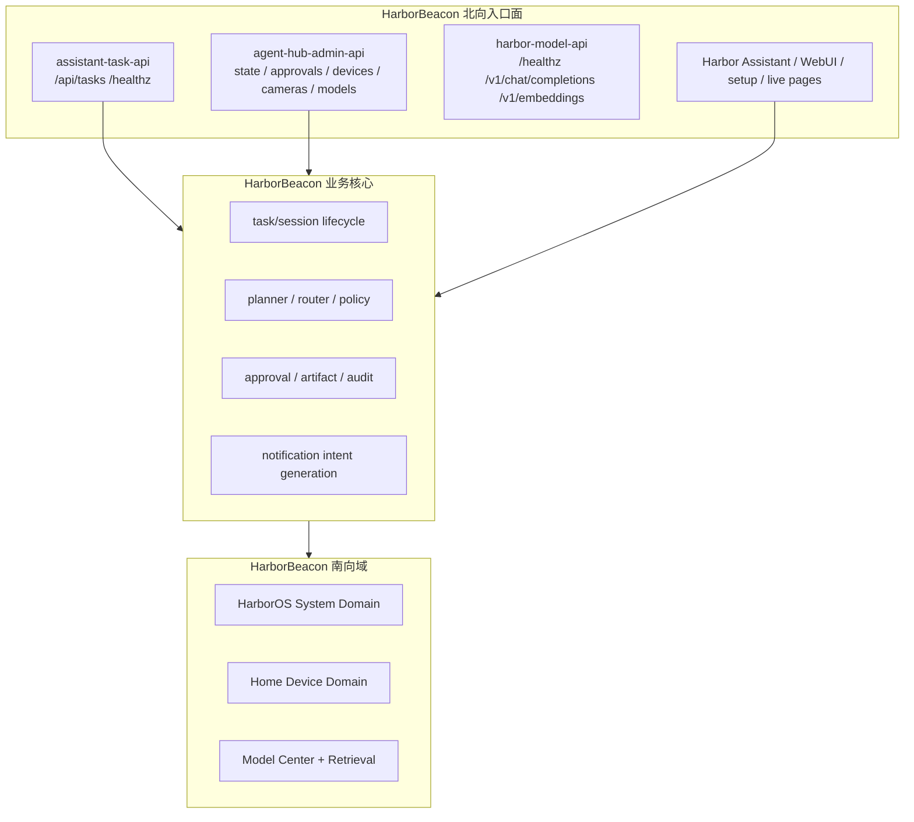

# HarborGate 到 HarborBeacon 全链路讲解稿

这份文档适合拿去做一次 `15-20 分钟` 的技术分享，主线只讲一件事：为什么我们把系统拆成 `HarborGate` 和 `HarborBeacon`，以及一条请求如何从北向入口进入、在 HarborBeacon 内部完成业务编排，再沿南向域能力执行，最后回到 HarborGate 完成 IM 出站。

如果只用两句话开场，可以这样说：

- `HarborGate` 负责 IM 平台接入、路由和投递，它是 northbound transport gateway，不是业务核心。
- `HarborBeacon` 负责任务、会话、审批、artifact、audit 和南向编排，它才是业务真相源。

状态标签统一如下：

- `[已落地]` 当前仓库里已经有实现或冻结契约
- `[在途]` 方向已经冻结，但仍在补齐联调、灰度或能力覆盖
- `[愿景]` 长期目标，当前不应被误讲成现状

## 1. 先把“北向”和“南向”讲清楚

建议讲法：先讲定义，再讲为什么要拆仓。这样后面的接口、路由、职责才不会混。

- 北向：面向用户、IM 平台、管理后台和上层产品面的入口能力。
- 南向：面向 HarborOS、设备、摄像头、协议适配器、本地模型和外部执行面的能力调用。

为什么拆成 `HarborGate + HarborBeacon`：

- `HarborGate` 专注 IM 平台接入、连接形态、route key、平台凭据和消息投递。
- `HarborBeacon` 专注任务语义、会话状态、审批、artifact、audit、planner/router/policy，以及南向执行。
- 两边只通过 HTTP/JSON 契约通信，不互相 import 运行时代码，也不共享 `.harborbeacon/*.json` 之类的运行时状态。

这次分享最重要的一句话是：

> 我们不是把“一个机器人”拆成两个进程，而是把“传输层”和“业务编排层”明确切开了。

## 2. 全链路总览

建议讲法：先放总图，不急着讲细节。先让大家建立“北向入口 -> HarborBeacon 核心 -> 南向执行 -> 出站回包”的脑图。

这张图里要强调三件事：

- `HarborGate` 是入口和出口，但不是任务真相源。
- `HarborBeacon` 是中间的业务核心，负责任务接收、状态保持和路由决策。
- HarborBeacon 内部不是“一条南向链路”，而是至少两条域：`HarborOS System Domain` 和 `Home Device Domain`。

## 3. HarborGate：北向传输网关，不是业务核心

建议讲法：这一段不要把 HarborGate 讲成“聊天机器人”，要把它讲成 IM transport gateway。

### 3.1 HarborGate 负责什么

- `[已落地]` IM adapter 注册与平台接入
- `[已落地]` webhook / websocket / long-poll 等不同接入模式
- `[已落地]` inbound event 归一化
- `[已落地]` `route_key` 和 `session_id` 生命周期
- `[已落地]` 平台凭据保存与验证
- `[已落地]` outbound delivery 和平台 payload 格式化
- `[已落地]` setup portal、redacted gateway status
- `[已落地]` 当配置 `HARBORBEACON_TASK_API_URL` 时，作为 HarborBeacon 的北向 transport gateway
- `[已落地]` 在未连 HarborBeacon 时，可回退到本地 demo brain 或 OpenAI-compatible backend 进行独立演练

### 3.2 HarborGate 当前平台覆盖

| 类型 | 平台 | 说明 |
|---|---|---|
| `[已落地]` live adapter | `feishu` | 飞书，websocket / long connection 为默认收消息主路 |
| `[已落地]` live adapter | `weixin` | Weixin 1:1 文本当前在 parity track |
| `[已落地]` live adapter | `webhook` | 通用 webhook 入口，便于演练和标准化消息注入 |
| `[已落地]` placeholder adapter | `telegram / discord / slack / whatsapp / signal / email / wecom` | 已接入同一 adapter registry 和 gateway flow，但多数仍是 placeholder |

要强调：

- `[已落地]` HarborGate 已经把“多平台入口”统一收口到同一 gateway flow。
- `[在途]` 并不是所有平台都已经 live，但北向 seam 已经稳定。

### 3.3 HarborGate 的接入模式

| 能力 | 说明 |
|---|---|
| `[已落地]` webhook | 平台主动推消息到 HarborGate |
| `[已落地]` websocket / long connection | 以飞书为代表，不要求公共 webhook 回调 |
| `[已落地]` long-poll | 以轮询或类似模式拉取平台消息 |

### 3.4 HarborGate 的关键内部语义

- `[已落地]` `route_key`：HarborGate 拥有的 opaque 路由句柄，HarborBeacon 只能写入和回传，不能解释平台语义。
- `[已落地]` `session_id`：会话级别的网关侧标识，用于绑定上下文。
- `[已落地]` `resume_token`：HarborGate 会按 chat 保存，并在下一轮 follow-up 时再带回 HarborBeacon。
- `[已落地]` `task_id` / `trace_id`：当 adapter 没有给出稳定标识时，HarborGate 会从 inbound event identity 派生稳定 ID。

### 3.5 HarborGate 暴露的北向运维面

- `[已落地]` `GET /setup/qr`
- `[已落地]` `GET /setup/qr.svg`
- `[已落地]` `GET /setup`
- `[已落地]` `GET /api/setup/status`
- `[已落地]` `POST /api/setup/feishu/configure`
- `[已落地]` `GET /api/gateway/status`
- `[已落地]` `POST /api/notifications/deliveries`

其中 `GET /api/gateway/status` 讲的时候建议顺手补一句：

- `[已落地]` 它会把平台状态归一化成类似 `not_configured / configured_placeholder / live` 的可观测口径。

讲的时候可以直接总结成一句：

> HarborGate 负责把“平台事件”变成“标准请求”，再把“业务回包”变回“平台消息”。

## 4. 双仓冻结边界：只保留三条跨仓语义线

建议讲法：这是全场最重要的一页。大家只要记住这三条线，系统边界就不会讲错。

| 方向 | 接口 | HarborGate 角色 | HarborBeacon 角色 |
|---|---|---|---|
| `[已落地]` HarborGate -> HarborBeacon | `POST /api/tasks` | northbound task ingress caller | task/business core receiver |
| `[已落地]` HarborBeacon -> HarborGate | `POST /api/notifications/deliveries` | notification delivery executor | notification intent producer |
| `[已落地]` HarborBeacon <- HarborGate | `GET /api/gateway/status` | redacted gateway status provider | admin/status consumer |

必须明确说出的边界规则：

- `[已落地]` `X-Contract-Version: 1.5` 是冻结契约头。
- `[已落地]` 两个冻结接口都要求 service-to-service auth。
- `[已落地]` 所有跨仓时间戳都用 RFC 3339 UTC。
- `[已落地]` HarborGate 拥有平台凭据；HarborBeacon 不再是 IM 凭据 owner。
- `[已落地]` HarborBeacon 拥有业务会话、审批、artifact、audit；HarborGate 不是业务真相源。
- `[已落地]` HarborBeacon 不再直接向平台发消息；消息投递由 HarborGate 执行。

### 4.1 `POST /api/tasks`：显式讲清 `TaskRequest`

讲法建议：不要把它讲成“一个大 JSON”，而要讲成“HarborGate 把一条 IM 事件翻译成标准任务”。

| 字段 | 含义 |
|---|---|
| `task_id` | 该业务 turn 的稳定 ID，用于幂等与重放 |
| `trace_id` | 跨组件追踪 ID |
| `step_id` | 当前步骤 ID |
| `source.channel` | 来源平台，如 `feishu`、`weixin` |
| `source.surface` | 来源面，当前主口径是 `harborgate` |
| `source.conversation_id` | 对话 ID |
| `source.user_id` | 用户 ID |
| `source.session_id` | 会话 ID |
| `source.route_key` | HarborGate 持有的 opaque 路由句柄 |
| `intent.domain` | 领域，如 `system`、`camera`、`knowledge`、`general` |
| `intent.action` | 动作，如 `status`、`scan`、`search` |
| `intent.raw_text` | 原始文本 |
| `args` | 结构化参数，恢复时也会带 `resume_token` |
| `autonomy.level` | 自主级别，如 `readonly / supervised / full` |
| `message.message_id` | 平台消息 ID |
| `message.chat_type` | 会话类型 |
| `message.mentions` | mention 信息 |
| `message.attachments` | 附件元数据和下载信息 |

必须点明两件事：

- `[已落地]` `message` block 是 HarborGate caller 的显式顶层字段，不把 IM 元数据塞进 `args`。
- `[已落地]` HarborBeacon 会持久化 `source.route_key`，但不会解释平台含义。

### 4.2 `TaskResponse`：显式讲清 HarborBeacon 回什么

| 字段 | 含义 |
|---|---|
| `task_id` | 对应请求任务 ID |
| `trace_id` | 贯穿日志与回溯 |
| `status` | `completed / needs_input / failed` |
| `executor_used` | 实际使用的执行器或路由 |
| `risk_level` | 风险等级 |
| `result.message` | 面向用户的主消息 |
| `result.data` | 结构化结果 |
| `result.artifacts` | 产物，如图片、链接、文件、媒体 |
| `result.events` | 可观测事件 |
| `result.next_actions` | 建议下一步 |
| `audit_ref` | 审计引用 |
| `missing_fields` | 当前缺失的输入，如 `approval_token` |
| `prompt` | 当 `status=needs_input` 时的人类可读提示 |
| `resume_token` | 后续恢复同一业务流的 opaque token |

要特别强调：

- `[已落地]` `needs_input` 不是失败，而是 HarborBeacon 发起的人机继续机制。
- `[已落地]` HarborGate 会把 `resume_token` 存到 chat metadata，下一轮再带回。

### 4.3 幂等、重放与冲突

- `[已落地]` HarborBeacon 会对 `task_id` 做 `accept / replay / conflict` 判断。
- `[已落地]` 同一个 `task_id` + 同一请求 identity，会被视为 replay，直接返回已知响应。
- `[已落地]` 同一个 `task_id` 但请求 identity 不同，会返回 `409 IDEMPOTENCY_CONFLICT`。

### 4.4 `POST /api/notifications/deliveries`

讲法建议：这条线的关键词不是“发消息”，而是“notification intent 交给 HarborGate 执行”。

| 字段 | 含义 |
|---|---|
| `notification_id` | 通知 ID |
| `trace_id` | 追踪 ID |
| `source` | 通知来源模块与事件类型 |
| `destination.route_key` | 首选路由标识 |
| `destination.platform / id / recipient` | 无 `route_key` 时的回退定位 |
| `content` | 标题、正文、格式、结构化 payload、附件 |
| `delivery.mode` | `send / reply / update` |
| `delivery.idempotency_key` | 出站幂等键 |

### 4.5 两类失败不能讲混

| 失败类型 | HTTP 语义 | 说明 |
|---|---|---|
| `[已落地]` request rejection | 非 200 + shared error envelope | 请求未被接受，例如 auth、version、validation、route 不存在 |
| `[已落地]` accepted-request delivery failure | `HTTP 200` + `ok=false` | 请求已被接受，但实际投递失败，比如 provider 限流或平台不可用 |

一句话记忆：

> 非 200 说明“没进业务处理”；`200 + ok=false` 说明“进了处理，但投递没成”。

### 4.6 `GET /api/gateway/status`

这条线的意义不是“查状态”，而是“HarborBeacon 不再碰平台原始凭据，只消费 redacted status”。

`GatewayStatusResponse` 讲的时候至少把这些字段说出来：

- `platforms[]`
  - `platform`
  - `enabled`
  - `connected`
  - `display_name`
  - `capabilities.reply / update / attachments`
- `manage_url`
- `gateway_base_url`

## 5. HarborBeacon：北向入口面和产品面

建议讲法：这一段不要按源码文件扫目录，而要按“入口面”讲。

### 5.1 `assistant-task-api`

- `[已落地]` `POST /api/tasks`
- `[已落地]` `GET /healthz`

这一层是 HarborBeacon 的标准任务入口。HarborGate 进来的标准 turn，最终都落到这里。

### 5.2 `agent-hub-admin-api`

这一层是管理、配置、设备面和产品面的入口，重点接口包括：

- `[已落地]` `GET /api/state`
- `[已落地]` `GET /api/account-management`
- `[已落地]` `GET /api/models/endpoints`
- `[已落地]` `POST /api/models/endpoints`
- `[已落地]` `PATCH /api/models/endpoints/{id}`
- `[已落地]` `POST /api/models/endpoints/{id}/test`
- `[已落地]` `GET /api/models/policies`
- `[已落地]` `PUT /api/models/policies`
- `[已落地]` `GET /admin/models`
- `[已落地]` `GET /api/access/members`
- `[已落地]` `GET /api/tasks/approvals`
- `[已落地]` `POST /api/tasks/approvals/{id}/approve`
- `[已落地]` `POST /api/tasks/approvals/{id}/reject`
- `[已落地]` `POST /api/discovery/scan`
- `[已落地]` `POST /api/devices/manual`
- `[已落地]` `GET /api/cameras/{device_id}/snapshot.jpg`
- `[已落地]` `GET /api/cameras/{device_id}/live.mjpeg`
- `[已落地]` `POST /api/cameras/{device_id}/share-link`
- `[已落地]` `POST /api/cameras/{device_id}/snapshot`
- `[已落地]` `POST /api/cameras/{device_id}/analyze`
- `[已落地]` `GET /api/share-links`
- `[已落地]` `POST /api/share-links/{id}/revoke`
- `[已落地]` `GET /api/admin/notification-targets`
- `[已落地]` `POST /api/admin/notification-targets`
- `[已落地]` 绑定二维码、mobile setup、shared live view page、Harbor Assistant 静态资源

讲的时候要顺手强调：

- `[已落地]` 这些页面和 API 是产品面。
- `[已落地]` 它们不是业务真相源，业务动作最终还是要走同一套 runtime / task / approval / audit 底座。

### 5.3 `harbor-model-api`

- `[已落地]` `GET /healthz`
- `[已落地]` `POST /v1/chat/completions`
- `[已落地]` `POST /v1/embeddings`

这一层是 HarborBeacon 的模型能力服务面。讲法要克制：

- 它不是另一条用户主入口。
- 它是 HarborBeacon 核心编排可以调用的能力服务。
- 当前支持 `openai_proxy` 主后端，也有 `candle` 候选后端与 benchmark gate。

### 5.4 Harbor Assistant / WebUI

- `[已落地]` Harbor Assistant、管理页、live view、shared page 都属于产品面。
- `[已落地]` 它们承担展示、配置和交互，不承担 task/business source-of-truth。

这句话要讲清：

> 页面可以很多，但任务真相只有一套。

## 6. HarborBeacon 业务核心：任务、会话、审批、artifact、audit 的真相源

建议讲法：这一段就是回答“HarborBeacon 到底核心在哪里”。

### 6.1 HarborBeacon 负责的业务真相

- `[已落地]` business session state
- `[已落地]` resumable workflow state
- `[已落地]` approval state
- `[已落地]` artifacts
- `[已落地]` audit trail
- `[已落地]` business conversation continuity
- `[已落地]` notification intent generation

从持久化对象上看，当前 HarborBeacon 这套真相至少覆盖：

- `[已落地]` `conversations / sessions / task_runs / task_steps`
- `[已落地]` `artifacts / approvals / events`
- `[已落地]` `media_sessions / share_links`

### 6.2 一条任务在 HarborBeacon 内部怎么走

1. `[已落地]` 入口接收：`assistant-task-api` 收到标准 `TaskRequest`
2. `[已落地]` 幂等检查：`accept / replay / conflict`
3. `[已落地]` 会话与状态恢复：从 `TaskConversationStore` 加载 session / conversation / pending resume
4. `[已落地]` planner / router / policy：判断 domain、action、risk、route
5. `[已落地]` 执行与审批：低风险继续执行，高风险返回 `needs_input` 或审批 ticket
6. `[已落地]` 结果沉淀：写入 task run、task step、artifact、event、approval、media/share link 等记录
7. `[已落地]` 返回 `TaskResponse`
8. `[已落地]` 如需后续触达，再生成 notification intent，交给 HarborGate 投递

### 6.3 为什么 `needs_input / approval / resume` 是核心能力

这不是边角料，而是 HarborBeacon 和普通“消息机器人”的根本区别：

- `[已落地]` 缺参数时，HarborBeacon 会返回 `status=needs_input`
- `[已落地]` 高风险操作会先变成 pending approval
- `[已落地]` 审批通过后，HarborBeacon 会基于 approval 上下文 replay/resume 原任务
- `[已落地]` HarborGate 只是把 prompt 和 resume_token 带回用户，并在后续 turn 再传回来

讲的时候可以直接下结论：

> HarborGate 负责“把话带到”，HarborBeacon 负责“把这件事做完整”。

## 7. 南向章节 A：HarborOS System Domain

建议讲法：这部分要把“系统域”和“设备域”切开，避免大家以为所有南向都走同一条 CLI。

### 7.1 固定优先级

`[已落地]` HarborOS System Domain 固定优先级：

`Middleware API -> MidCLI -> Browser/MCP fallback`

这条线的含义是：

- 先用 HarborOS 原生系统接口
- 再退到 `midcli`
- 再退到 browser/MCP，但它们只是 fallback，不代表 HarborOS ownership 被转移

### 7.2 当前已落地系统能力

| 能力 | 首选路由 | 说明 |
|---|---|---|
| `[已落地]` `service.query` | Middleware API | 服务查询 |
| `[已落地]` `service.control` | Middleware API | 服务 start/stop/restart，受审批和风险门禁约束 |
| `[已落地]` `files.copy` | Middleware API | 文件复制 |
| `[已落地]` `files.move` | Middleware API | 文件移动 |
| `[已落地]` `files.list` | Middleware API | 目录列表 |

### 7.3 明确哪些只是 scaffold helper

| 能力 | 状态 | 解释 |
|---|---|---|
| `files.stat` | `[已落地] scaffold helper` | framework preview helper，不应讲成 HarborOS 原生产品面 |
| `files.read_text` | `[已落地] scaffold helper` | 只用于安全元数据/文本辅助，不承接检索、排序、引用、回答语义 |

必须明确说：

- `[已落地]` HarborOS system control 不吸收 AIoT 设备原生 ownership。
- `[已落地]` Browser/MCP 的存在不代表 HarborOS 业务能力可以无限泛化。

## 8. 南向章节 B：Home Device Domain

建议讲法：这一段要说明“摄像头和设备控制不是 HarborOS CLI 的附庸”，而是独立南向域。

### 8.1 推荐链路

`[已落地]` Home Device Domain 推荐链路：

`Native Adapter -> LAN Bridge -> HarborOS Connector -> Cloud/MCP`

这条链路的意思是：

- 设备原生协议优先
- 局域网桥接次之
- HarborOS 可以提供存储、归档、协调、转接，但不吞并设备控制 ownership
- Cloud/MCP 只作为更远层的补位

### 8.2 协议与适配器

| 协议/能力 | 作用 |
|---|---|
| `[已落地]` `ONVIF` | 发现、控制、PTZ 等设备原生能力 |
| `[已落地]` `SSDP` | 局域网设备发现 |
| `[已落地]` `mDNS` | 局域网服务发现 |
| `[已落地]` `RTSP probe` | 媒体连通性验证与流入口发现 |
| `[已落地]` vendor-cloud bridge | 厂商云桥接或补位控制 |

### 8.3 当前任务面上已经能讲的摄像头能力

当前 Task API 面向业务的摄像头动作，至少可以这样讲：

- `[已落地]` `camera.scan`
- `[已落地]` `camera.connect`
- `[已落地]` `camera.snapshot`
- `[已落地]` `camera.share_link`
- `[已落地]` `camera.analyze`

### 8.4 需要显式列出来的 device domain actions

这部分建议单独讲，因为它体现的是域抽象，而不是单一产品流程。

| 动作 | 说明 |
|---|---|
| `[已落地]` `discover` | 发现设备 |
| `[已落地]` `list` | 列出设备 |
| `[已落地]` `get` | 查看单设备 |
| `[已落地]` `update` | 更新设备资料 |
| `[已落地]` `snapshot` | 抓拍 |
| `[已落地]` `open_stream` | 打开直播流 |
| `[已落地]` `ptz` | 云台控制 |

### 8.5 这一域为什么重要

Home Device Domain 不只是“摄像头 demo”，它已经把这些平台级问题推到了前台：

- `[已落地]` 设备发现
- `[已落地]` 设备接入
- `[已落地]` 媒体和控制分离
- `[已落地]` 直播、分享、抓拍、分析
- `[已落地]` 人机补参与长任务状态
- `[已落地]` artifact、share link、media session 这些公共能力

## 9. 能力补能：Model Center + Multimodal Retrieval

建议讲法：这一段要说明它不是第三条主链，而是 HarborBeacon 核心的能力补能层。

### 9.1 它的定位

- `[已落地]` model center 已经接入 HarborBeacon framework 层
- `[已落地]` 它不是单独的 northbound product
- `[已落地]` 它为 HarborBeacon 提供可配置的 OCR、embedding、answer、vision_summary 能力槽位

### 9.2 当前范围

- `[已落地]` `document + image + OCR` 已进入同一条检索主线
- `[已落地]` retrieval 由 HarborBeacon 自己负责 citation / reply pack
- `[在途]` `vision_summary` 已在 policy 中有位置，但没有配置 VLM 时仍是 degraded
- `[愿景]` `audio / video / full multimodal` 还不是当前第一阶段主交付

### 9.3 当前策略位

| 策略位 | 当前口径 |
|---|---|
| `[已落地]` `retrieval.ocr` | 优先本地 `tesseract` |
| `[已落地]` `retrieval.embed` | 优先本地 OpenAI-compatible endpoint |
| `[已落地]` `retrieval.answer` | local-first，允许 cloud fallback |
| `[已落地]` `retrieval.vision_summary` | 已有策略位，但依赖后续 VLM 配置 |

### 9.4 这一段最容易讲错的点

- 不要把 model center 讲成“另一套机器人后端”。
- 不要把 OCR / vector search 讲到 HarborOS 或 AIoT 域里去。
- 要明确：检索语义、排名、citation packaging 和回复意义仍归 HarborBeacon。

## 10. 三个端到端案例：把全链路讲活

建议讲法：如果时间有限，这三条故事足够覆盖整个架构。

### 案例一：IM 状态查询打到 HarborOS System Domain

适合讲“最标准的一条同步 turn”。

1. 用户在飞书或微信发出“status ssh”一类消息。
2. HarborGate adapter 接收平台事件，归一化为 inbound message。
3. HarborGate 生成或继承 `task_id / trace_id / session_id / route_key`。
4. HarborGate 调用 HarborBeacon `POST /api/tasks`。
5. HarborBeacon 将请求识别为 system/service 类动作。
6. HarborBeacon 按 `Middleware API -> MidCLI -> Browser/MCP fallback` 决定执行路径。
7. 执行结果写入 task run、event、audit。
8. HarborBeacon 返回 `TaskResponse`。
9. HarborGate 将结果映射为平台 reply，回给用户。

要点：

- `[已落地]` 这是 HarborGate 进、HarborBeacon 判、system domain 执行、HarborGate 回的标准主链。

### 案例二：高风险操作走 `needs_input / approval / resume`

适合讲“为什么 HarborBeacon 不是一个薄转发层”。

1. 用户发起 `service.restart` 或高风险文件操作。
2. HarborGate 正常调用 `POST /api/tasks`。
3. HarborBeacon policy 判断该动作需要 approval。
4. HarborBeacon 不直接执行，而是返回：
   - `status=needs_input`
   - `missing_fields=["approval_token"]` 或审批 ticket
   - `prompt`
   - `resume_token`
5. HarborGate 把 prompt 回给用户，或由管理面看到待审批任务。
6. 审批通过后，HarborBeacon 根据 approval context replay/resume 原请求。
7. 执行完成后返回最终结果，必要时再通过 HarborGate 发送通知。

要点：

- `[已落地]` HarborGate 不拥有审批真相，只是传递和回带。
- `[已落地]` HarborBeacon 才拥有 approval state、resume flow 和 audit correlation。

### 案例三：摄像头发现 -> 接入 -> 抓拍/分析 -> 通知回送

适合讲“为什么 Home Agent Hub 是第一个正式垂直域”。

1. 用户通过 IM 或管理面发起扫描。
2. HarborBeacon 走 device domain，调用 `ONVIF / SSDP / mDNS / RTSP probe`。
3. 返回候选设备列表。
4. 用户确认接入，如果需要密码，HarborBeacon 进入 `needs_input` 补参流程。
5. 接入成功后，设备进入 registry。
6. 用户发起抓拍、直播、分析或分享。
7. HarborBeacon 调用媒体与视觉链路，生成 snapshot、share link、analysis artifact。
8. 结果作为 `TaskResponse` 返回；如果是后续事件，也可生成 notification intent 交给 HarborGate 投递。

要点：

- `[已落地]` 这条链路同时覆盖了 device discovery、HITL 补参、artifact、media session、notification contract。

## 11. 为什么 Home Agent Hub 是第一个垂直域，而不是旁路产品

建议讲法：这一段是收束，不是扩展。

Home Agent Hub 被定义为第一个正式垂直域，不是因为它“先做完了一个 demo”，而是因为它已经验证了这些能力必须上升为平台抽象：

- `[已落地]` Artifact envelope：文本、图片、录像、预览链接、分享链接、动作卡片
- `[已落地]` Long-running task：扫描、RTSP 探测、抓流、录像、视觉分析都不是单次 RPC
- `[已落地]` Entity resolution：从自然语言解析设备、房间、对象、绑定用户
- `[已落地]` Human-in-the-loop 补参：扫描后选号、认证失败补密码、继续执行
- `[已落地]` Sidecar worker pattern：`ffmpeg`、YOLO / vision sidecar、本地播放器等

所以结论不是“我们做了一个摄像头子系统”，而是：

> 我们用 Home Agent Hub 把 HarborBeacon 的平台抽象压实了。

## 12. 最后一分钟总结版

如果讲到最后只剩一分钟，可以这样收口：

1. HarborGate 是 transport gateway，负责 IM 接入、route key、平台凭据和投递。
2. HarborBeacon 是 business core，负责任务、会话、审批、artifact、audit 和通知意图。
3. HarborBeacon 南向至少分两域：HarborOS system domain 和 Home Device domain，不能混成一个 generic adapter bucket。
4. model center 和 retrieval 是 HarborBeacon 的能力补能层，不是另一条主链。
5. Home Agent Hub 之所以重要，是因为它把平台抽象从“文档概念”推进成了“真实域能力”。

---

## 附录 A：北向接口 / 入口矩阵

| 层级 | 入口/接口 | 主要路径 | 角色定位 | 状态 |
|---|---|---|---|---|
| HarborGate | 平台消息入口 | `POST /messages/<platform>` | 适配器归一化入口 | `[已落地]` |
| HarborGate | 飞书 setup portal | `/setup`, `/setup/qr`, `/setup/qr.svg`, `/api/setup/status`, `/api/setup/feishu/configure` | 北向配置与启动引导 | `[已落地]` |
| HarborGate | redacted gateway status | `GET /api/gateway/status` | 只暴露脱敏连接状态与能力，不暴露原始凭据 | `[已落地]` |
| HarborGate -> HarborBeacon | task ingress seam | `POST /api/tasks` | 冻结跨仓任务入口 | `[已落地]` |
| HarborBeacon | assistant-task-api | `POST /api/tasks`, `GET /healthz` | 统一任务入口 | `[已落地]` |
| HarborBeacon | agent-hub-admin-api | `/api/state`, `/api/account-management`, `/api/models/endpoints`, `/api/models/policies`, `/admin/models`, `/api/access/members`, `/api/tasks/approvals`, `/api/discovery/scan`, `/api/devices/manual`, `/api/cameras/*`, `/api/share-links`, `/api/admin/notification-targets` | 管理面与产品面入口 | `[已落地]` |
| HarborBeacon | binding / setup / live pages | `/setup/mobile`, `/live/cameras/*`, `/shared/cameras/*`, `/api/binding/*` | 交互面和展示面 | `[已落地]` |
| HarborBeacon | harbor-model-api | `/healthz`, `/v1/chat/completions`, `/v1/embeddings` | 模型能力服务面 | `[已落地]` |
| HarborBeacon -> HarborGate | notification seam | `POST /api/notifications/deliveries` | 冻结跨仓通知投递意图 | `[已落地]` |
| Harbor Assistant / WebUI | Web 前端 | Harbor Assistant dist / static pages | 产品展示面，不是业务真相源 | `[已落地]` |

## 附录 B：南向能力 / 路由矩阵

| 域 | 能力组 | 具体动作/能力 | 首选路由 | 回退/补位 | 状态 |
|---|---|---|---|---|---|
| HarborOS System Domain | 服务查询 | `service.query` | Middleware API | MidCLI -> Browser/MCP fallback | `[已落地]` |
| HarborOS System Domain | 服务控制 | `service.control` | Middleware API | MidCLI -> Browser/MCP fallback | `[已落地]` |
| HarborOS System Domain | 文件浏览 | `files.list` | Middleware API | MidCLI -> Browser/MCP fallback | `[已落地]` |
| HarborOS System Domain | 文件复制 | `files.copy` | Middleware API | MidCLI -> constrained fallback | `[已落地]` |
| HarborOS System Domain | 文件移动 | `files.move` | Middleware API | MidCLI -> constrained fallback | `[已落地]` |
| HarborOS System Domain | scaffold helper | `files.stat`, `files.read_text` | helper only | 不应上升为 HarborOS 原生产品语义 | `[已落地]` |
| Home Device Domain | 发现 | `discover`, `camera.scan` | Native Adapter | LAN Bridge -> HarborOS Connector -> Cloud/MCP | `[已落地]` |
| Home Device Domain | 设备注册/更新 | `list`, `get`, `update`, `camera.connect` | Native Adapter / Registry | HarborOS Connector / vendor-cloud bridge | `[已落地]` |
| Home Device Domain | 抓拍 | `snapshot`, `camera.snapshot` | RTSP / native snapshot path | HarborOS-backed storage / sidecar | `[已落地]` |
| Home Device Domain | 直播 | `open_stream` | RTSP / media session | local player / MJPEG / share flow | `[已落地]` |
| Home Device Domain | 分享 | `camera.share_link` | Media / share-link runtime | HarborOS-backed archive or public link policy | `[已落地]` |
| Home Device Domain | 分析 | `camera.analyze` | vision executor / sidecar | model center / retrieval assist | `[已落地]` |
| Home Device Domain | PTZ 控制 | `ptz` | ONVIF / vendor-native control | vendor-cloud bridge | `[已落地]` |
| Model Center + Retrieval | OCR | `retrieval.ocr` | local tesseract | other OCR endpoint | `[已落地]` |
| Model Center + Retrieval | embedding | `retrieval.embed` | local OpenAI-compatible endpoint | cloud-compatible endpoint | `[已落地]` |
| Model Center + Retrieval | answer | `retrieval.answer` | local-first | cloud fallback | `[已落地]` |
| Model Center + Retrieval | vision summary | `retrieval.vision_summary` | VLM endpoint when configured | degraded until configured | `[在途]` |
| Multimodal 平台愿景 | audio / video / full multimodal | 更完整媒体理解链 | 待定 | 待定 | `[愿景]` |
